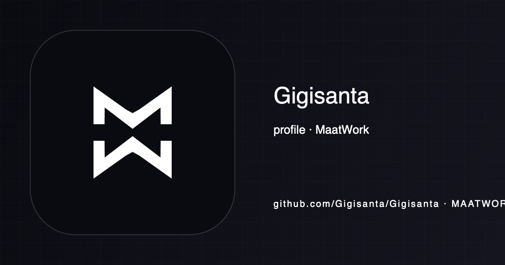

<!-- maatwork-brand:maatwork-mw-20260901 -->

> profile de MaatWork

# Gio Santarelli — Product & Applied AI Engineer

I build production software for messy operational problems: financial-advisory systems, local LLM infrastructure, native macOS tools and agent workflows.

**Argentina · UTC−3 · English C2** 
**Argentina + EU citizenship · available for remote employment or global contractor work**

[Portfolio](https://maat.work/giolivosantarelli) · [Resume](https://maat.work/giolivosantarelli/Giolivo-Garcia-Santarelli-Resume.pdf) · [LinkedIn](https://www.linkedin.com/in/giolivo-garcia-451954322/) · [Email](mailto:hola@maat.work?subject=Interview%20with%20Gio)

## Start here

For AI automation, agent-platform or reliability roles, start with QuotaMax:
it is the public repository that most directly shows how I build, test and
operate an AI system when upstreams fail.

| Repository | What it proves | Stack |
|---|---|---|
| **[QuotaMax Router](https://github.com/Gigisanta/hermes-quota-max-router)** | OpenAI-compatible routing with fallback, quota and budget controls, Prometheus metrics, failure alerts, an incident runbook and **81.89% measured line coverage** | Python, FastAPI, Redis, GitHub Actions |
| **[MeetCapture](https://github.com/Gigisanta/MeetCapture)** | Native macOS audio capture, live local transcription, diarization and durable handoff — no meeting bot or cloud audio | Swift, SwiftUI, Core Audio, sherpa-onnx |
| **[QuantUcema](https://github.com/Gigisanta/QuantUcema)** | Fama–French 5-factor estimation and constrained max-Sharpe / information-ratio portfolio optimization | Python, pandas, statsmodels, SciPy |
| **[sleeplike](https://github.com/Gigisanta/sueno-claro)** | Privacy-first bilingual sleep calculator that runs locally with no account, microphone or application backend | Next.js, TypeScript, Vitest, Playwright |

## Private product systems

| Product | Product surface | Engineering evidence |
|---|---|---|
| **iStock** | Inventory and WhatsApp storefront SaaS for phone resellers | Multi-tenancy, Postgres RLS, image pipeline, subscriptions, idempotent webhooks and CI |
| **RealEstate OS** | Lead-centered operating system for real-estate teams | Next.js monorepo, explainable scoring, RBAC, audit trail and transactional outbox |
| **MiKiosco** | POS, cash register and inventory for small shops | Offline sales queue, role-based auth, serverless APIs and PostgreSQL |

iStock is a functional pre-production product; RealEstate OS and MiKiosco are
private-source engineering builds. I can walk through their architecture,
tests and trade-offs without publishing the repositories. Production usage
claims below apply only where they are stated explicitly.

## Selected production work

### Financial advisory CRM

A production operating system used by two advisory teams. Its 56-table PostgreSQL model covers clients, portfolios, positions, risk profiles and compliance, with a Next.js product surface and automated test coverage.

`Next.js · React · TypeScript · Prisma · PostgreSQL · Playwright`

Private client system. I can walk through the architecture, schema, tests and trade-offs live.

### Apple Silicon LLM inference

Profiled a 27B model on an M2 Max, found 93% of decode time in one quantized matrix-vector kernel and replaced it in Metal. Throughput moved from **13.3 to 27.8 tok/s** while output remained **hash-identical** at every optimization step.

`Metal · MLX · Python · quantization · profiling`

### Agent operations platform

Built an API-first mission control for projects, tasks, deploys, prompts and agent activity. It includes scoped agent keys, idempotent writes, webhooks, inbox handoffs and a typed MCP surface.

`Next.js · TypeScript · PostgreSQL · REST · MCP`

### Local inference gateway

Built an OpenAI-compatible gateway for local models with streaming, tier routing, GPU turn-taking, wake-on-demand and abort-on-disconnect. A measured 24-hour window served **7,400 requests**.

`Python · SSE · MLX · GPU scheduling`

## The domain edge

I am also a licensed financial advisor in Argentina and hold a quantitative-finance certificate from UCEMA. That experience is why the fintech work above models real advisory, portfolio and compliance workflows instead of a demo business.

## How I work

- Measure the bottleneck before choosing the technology.
- Make safety and business constraints explicit in the architecture.
- Use AI heavily for implementation, never as a substitute for judgment or verification.
- Prefer a reproducible benchmark, test or commit over an adjective.

I bring production systems, public code and specific engineering decisions I
can defend under questioning. My path combines self-directed engineering with
regulated financial work, so I am comfortable owning both implementation and
the operational consequences of the software.

## Best-fit roles

`Product Engineer` · `Applied AI Engineer` · `Solutions Engineer` · `Fintech Engineer`

If the role needs someone who can translate a real workflow into a reliable product, [let's talk](https://www.linkedin.com/in/giolivo-garcia-451954322/).
